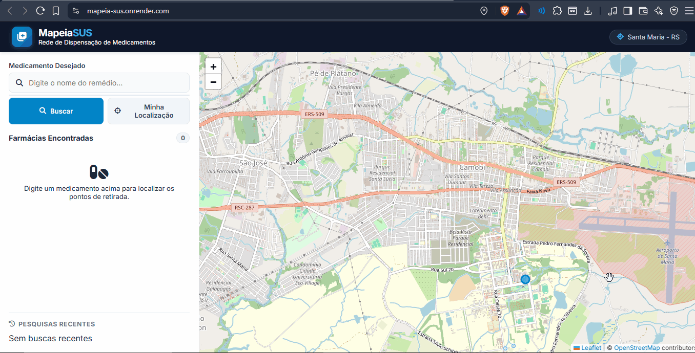

# Projeto: Aplicação com persistência de dados em backend



## Acesso

Acesso: https://mapeia-sus.onrender.com/

## Desenvolvedor
Carlos Eduardo Velozo, Ciência da Computação


## Proposta
App web para mapear pontos de retirada de medicamentos do SUS. O usuário deve ser capaz de inserir o nome de um medicamento e visualizar os endereços das farmácias onde pode ser retirado. Ser capaz de filtrar pela farmácias mais próxima. Interface legal.
Modalidade escolhida: B


## Parceria/cliente/usuário
Miguel Brondani

## Feedback/comentário da parceria/cliente/usuário
Aplicação atende as funcionalidades: usuário é capaz de inserir o nome de um medicamento e farmácias de retirada são corretamente mostradas no mapa. Histórico de busca persistente mesmo quando a página é recarregada. Fácil de usar. Quando localização é compartilhada, app corretamente mostra a farmácia mais proxima.

## Desenvolvimento

### Processo

Para começar a trabalhar na aplicação utilizei da IA para fazer um tamplate simples de HTML e CSS para orientação, logo em seguida comecei a implementação do backend. Para a comunicação do sistema, utilizei requisições GET para consultar medicamentos, sugestões de autocomplete e o histórico do banco SQL. Já para garantir a persistência dos dados, estruturei endpoints POST para enviar e salvar cada pesquisa do usuário na base de dados. Um dos desafios iniciais foi que eu precisava ordenar as farmácias da mais próxima para a mais distante com base no GPS do usuário, mas sem sobrecarregar o servidor Flask com requisições geográficas contínuas. Para resolver esse problema eu descobri a Fórmula de Haversine que quando o usuário concede permissão de localização, o algoritmo calcula a distância em quilômetros entre as coordenadas do usuário e de cada farmácia retornada pela API, reordenando o vetor de resultados e destacando o card da farmácia mais próxima. Uma das dificuldades que tive no Leaflet foi de tentar alterar o tileLayer reduzindo os detalhes do mapa porém as opções que eu buscava e diziam que eram gratuitas necessitavam de uma chave de API autenticada, desse modo decedi utilizar o padrão openstreatmap. Outra coisa que não sabia e acabei aprendendo foi de como hospedar um site, pesquisando de forma rapida aprendi como usar o render e hospedar uma aplicação web, alterando parametros como Root Directory para apontar diretamente para aplicação que estava numa subpasta como também dar Build no script em python para a criação do Banco de dados.


### Trechos de código

Indique pelo menos 3 trechos de código que você queira destacar para a turma (por exemplo, para explicar algo que aprendeu, para alertar sobre alguma dificuldade de compreensão, para mostrar uma curiosidade, etc).

Escolhi destacar este trecho porque foi onde aprendi a processar e manipular dados geográficos diretamente no lado do cliente. Com essa função, consegui capturar a localização atual do GPS do usuário, calcular em tempo real a distância em quilômetros até cada farmácia cadastrada e reordenar automaticamente a lista de resultados da mais próxima para a mais distante.

```
// Cálculo de distância em KM entre duas coordenadas geográficas
function calcularDistanciaKM(lat1, lon1, lat2, lon2) {
    const R = 6371; // Raio médio da Terra em km
    const dLat = (lat2 - lat1) * Math.PI / 180;
    const dLon = (lon2 - lon1) * Math.PI / 180;
    const a = 
        Math.sin(dLat/2) * Math.sin(dLat/2) +
        Math.cos(lat1 * Math.PI / 180) * Math.cos(lat2 * Math.PI / 180) * 
        Math.sin(dLon/2) * Math.sin(dLon/2);
    const c = 2 * Math.atan2(Math.sqrt(a), Math.sqrt(1-a));
    return R * c;
}

// Ordenação dinâmica das farmácias no momento da busca
if (userLocation) {
    farmacias.forEach(f => {
        f.distancia = calcularDistanciaKM(userLocation.lat, userLocation.lng, f.lat, f.lng);
    });
    farmacias.sort((a, b) => a.distancia - b.distancia); // Ordena da menor para a maior distância
}
```
Trouxe este trecho sobre um desafio técnico que enfrentei durante o projeto. Percebi que o operador LIKE do SQLite não ignora acentos por padrão, quando eu pesquisava por "acido", o banco não encontrava "ÁCIDO ACETILSALICÍLICO". Para resolver isso, criei a função remover_acentos usando a biblioteca unicodedata e passei a alimentar uma coluna auxiliar nome_busca na criação do banco, garantindo que qualquer busca funcionasse perfeitamente, com ou sem acentuação.

```
import unicodedata

# Remove acentos e converte para minúsculas
def remover_acentos(texto):
    if not texto:
        return ""
    nfkd = unicodedata.normalize('NFKD', texto)
    return "".join([c for c in nfkd if not unicodedata.combining(c)]).lower().strip()

# Na consulta SQL (app.py), compara-se o termo pesquisado (normalizado) com 'nome_busca'
@app.route('/api/buscar', methods=['GET'])
def buscar():
    query_norm = remover_acentos(request.args.get('medicamento', ''))
    sql = '''
        SELECT DISTINCT f.nome, f.endereco, f.lat, f.lng, f.imagem, m.nome as medicamento
        FROM farmacias f
        JOIN medicamentos m ON LOWER(f.nome) = LOWER(m.farmacia_nome)
        WHERE m.nome_busca LIKE ?
    '''
    rows = conn.execute(sql, (f'%{query_norm}%',)).fetchall()
    return jsonify([dict(r) for r in rows])
```
Escolhi este código por curiosidade técnica que me deu um certo trabalho no histórico de buscas. O SQLite salva os registros em tempo universal (UTC), mas quando eu renderizava esse horário no navegador, ele aparecia 3 horas adiantado em relação ao nosso fuso. Aprendi que, ao formatar a string adicionando o caractere 'Z', o JavaScript passa a reconhecer o tempo como UTC e faz a conversão automática para o fuso horário local do computador do usuário.

```
// Conversão de data do banco (UTC) para o fuso local do navegador
async function carregarHistorico() {
    const res = await fetch('/api/historico');
    const historico = await res.json();
    
    ul.innerHTML = historico.map(h => {
        // O replace e o sufixo 'Z' forçam o Date a interpretar a string como tempo universal (UTC)
        const dataUTC = new Date(h.data_hora.replace(' ', 'T') + 'Z');
        const horaFormatada = dataUTC.toLocaleTimeString([], {hour: '2-digit', minute:'2-digit'});

        return `
            <li class="history-item" onclick="reutilizarBusca('${h.termo_busca.replace(/'/g, "\\'")}')">
                <span class="history-term"><i class="fa-solid fa-clock-rotate-left"></i> ${h.termo_busca}</span>
                <span class="history-time">${horaFormatada}</span>
            </li>
        `;
    }).join('');
}
```
## Tecnologias

### Linguagens e afins

- Python
- JavaScript
- SQLite
- HTML e CSS
- Flask
- Leaflet.js
- Gunicorn (Render)
- JSON e CSV

### Ambiente de desenvolvimento

- Visual Studio Code (VS Code)
- Git & GitHub
- Render
- Gemini

## Referências e créditos

- Créditos ao Miguel Brondani que forneceu tanto o csv de medicamentos quanto os endereços das fármacias locais
- https://leafletjs.com/reference.html
- https://developer.mozilla.org/en-US/docs/Web/HTML
- https://developer.mozilla.org/en-US/docs/Web/CSS
- https://developer.mozilla.org/en-US/docs/Web/JavaScript


---
Projeto entregue para a disciplina de [Desenvolvimento de Software para a Web](http://github.com/andreainfufsm/elc1090-2026b) em 2026b